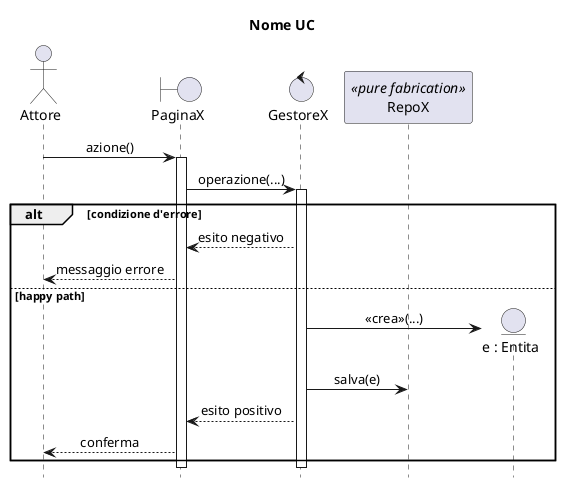

# Convenzioni dei diagrammi — HackHub (guida operativa)

> **Scopo.** Come fare i diagrammi del progetto in modo **coerente** (nomi, stereotipi, notazione, layout) con quanto realizzato in **Visual Paradigm** nell'iterazione 1. **Da seguire sempre.**
> **Fonte di verità del contenuto** = file `.puml`. **Layout/deliverable finale** = Visual Paradigm.
> Riferimenti reali da imitare: `iterazione1/progetto/CLASSI_PROGETTO_REALIZZATI.jpg` (progetto), `iterazione1/analisi/CLASSI_ANALISI_REALIZZATI.puml` (analisi), `iterazione1/diagrammiSequenza/*/SEQ_*.puml` (sequenza). Esempio "fatto bene" per la 2a iterazione: `iterazione2/progetto/CLASSI_PROGETTO_CHANGE2.puml`.

---

## 0. Regole trasversali (valgono per tutti i diagrammi)

- **`.puml` = fonte di verità**; si committano **PNG + SVG** accanto. Render: `./scripts/render-diagrams.sh` (solo Docker; ELK richiede Java 17, già nel container `plantuml/plantuml`). Lo script copre tutte le `iterazione*`.
- **Motore di layout:** `!pragma layout elk` + `hide empty members` + `hide circle` (per i diagrammi a grafo: classi, oggetti, componenti).
- **Regola `*REALIZZATI` / `*CHANGE`:** i `*REALIZZATI` sono la versione autorevole dell'utente → **non si toccano**. Le proposte di Claude vanno in `*CHANGE`; l'utente le **promuove** rifinendole in Visual Paradigm. `legacy/` = solo consultazione.
- **Verifica visiva obbligatoria:** si renderizza e si guarda il PNG. Niente linee intrecciate; archi lunghi inevitabili (cicli del modello) → instradati sul **margine** senza incroci e rifiniti in VP. **Mai stravolgere il modello per la grafica.**
- **Limite di PlantUML/ELK:** l'auto-layout **non** riproduce le posizioni di Visual Paradigm. Quindi il `.puml` fissa **nomi / convenzioni / notazione**; le **posizioni** si rifiniscono in VP (è normale che l'auto-render dei diagrammi grandi sia denso).

---

## 1. Diagramma delle classi di ANALISI (stile _domain model_)

Riferimento: `iterazione1/analisi/CLASSI_ANALISI_REALIZZATI.puml` (e `iterazione2/analisi/CLASSI_ANALISI_CHANGE.puml`).

- Stile **domain model** (UML_03 slide 13): **niente operazioni**; **tipi e visibilità omessi** (si mostra solo il tipo degli attributi enum, es. `stato : Stato`).
- Stereotipo classi: **`<<entità>>`** (con accento, minuscolo).
- **Relazioni reificate come classi-associazione** (`(A, B) .. C`); enum per gli stati.
- Ogni relazione ha **nome** e **molteplicità su entrambi gli estremi**; `..>` per le dipendenze verso le enum.
- **Vincoli non esprimibili graficamente → in legenda** (niente note appese che si incrociano).

---

## 2. Diagramma delle classi di PROGETTAZIONE ← il punto critico (coerenza con VP)

Riferimento autorevole: **`iterazione1/progetto/CLASSI_PROGETTO_REALIZZATI.jpg`**. Esempio coerente: `iterazione2/progetto/CLASSI_PROGETTO_CHANGE2.puml`.

### 2.1 Stereotipi (ESATTI)

- **`<<Handler>>`** — boundary (endpoint REST).
- **`<<service>>`** — control (GRASP Controller, Spring `@Service`).
- **`<<Entity>>`** — classe di dominio.
- **`<<Repository>>`** — persistenza (Spring Data, Pure Fabrication).
- **`<<enumeration>>`** — enum. **`<<interface>>`** — interfacce (es. pattern Observer).
- **`<<adapter>>`** — adapter concreto del pattern **Adapter** (iter. 3): gateway verso un sistema esterno (es. `AdapterCalendar`). Realizza la porta «interface» (es. `CalendarGateway`).
- **`<<sistema esterno>>`** — sistema/servizio esterno (Adaptee del pattern Adapter), es. `Calendar`. Raggiunto **solo** tramite l'adapter; i `service` dipendono dalla porta, mai dall'API esterna.

### 2.2 Visibilità, tipi, firme (UML_07 slide 3)

- Visibilità esplicita + tipi + firme precise, con spazi attorno ai `:`
  `- nome : string` · `+ numeroMembri() : int` · `+ assegnaStaff(organizzatore : Utente, giudice : Utente, mentori : List<Utente>) : void`.
- Tipi usati: `string`, `int`, `long`, `boolean`, `date`, `dateTime`, `Date`, `List<X>`, tipi di dominio.

### 2.3 Layer e naming (come iter-1)

- **Boundary `<<Handler>>`: per caso d'uso** — es. `HandlerCreaHackathon`, `HandlerCreaTeam`, `HandlerIscrizione`, `HandlerSottomissione`, `HandlerValutazione` (+ nuovi: `HandlerAvviaHackathon`, `HandlerIniziaFaseValutazione`, `HandlerProclamaVincitore`, `HandlerInvitaMembro`, `HandlerAccettaInvito`).
- **Control `<<service>>`: naming MISTO storico** — `GestoreTeam`, `GestoreHackathon` **ma** `ServiceIscrizione`, `ServiceValutazione`, `ServiceSottomissione`. Per i nuovi control allinearsi all'area più vicina (es. inviti → `GestoreInvito`). _(Naming misto noto: se si decide di uniformarlo, aggiornare questa riga e tutti i diagrammi.)_
- **Persistenza `<<Repository>>`: `Repo*`** (`RepoTeam`, `RepoUtente`, `RepoHackathon`, `RepoIscrizione`, `RepoSottomissione`, `RepoValutazione`, `RepoInvito`). **Solo i `service` accedono ai `Repo`.**
- **Entità `<<Entity>>`**: dominio con attributi + operazioni. `Hackathon` **mantiene l'attributo `stato : Stato`**.

### 2.4 Relazioni (la differenza che conta)

- **Classi-associazione MANTENUTE** (NON reificate in composizioni): `Incarico`, `Appartenenza`, `Iscrizione` restano classi-associazione con `(A, B) .. C` e l'associazione **etichettata** (`incarico` / `appartenenza` / `iscrizione`).
- **Catena del valore** con label: `Iscrizione "1" -- "0..1" Sottomissione : contiene` · `Sottomissione "1" -- "0..1" Valutazione : riceve` · `Utente "1" -- "0..*" Valutazione : redige`.
- **Navigabilità `-->`** dove la conoscenza è unidirezionale: `Hackathon "0..*" --> "1" Stato : stato corrente` · `Hackathon "0..*" --> "0..1" Team : vincitore`.
- **Molteplicità su entrambi gli estremi** (UML_07 slide 11).
- **Dipendenze etichettate `<<use>>`**: EBC e verso enum → `A ..> B : <<use>>` (es. `HandlerX ..> ServiceX : <<use>>`, `ServiceX ..> RepoY : <<use>>`, `Incarico ..> RuoloStaff : <<use>>`).

### 2.5 Pattern

- **State (GoF):** `Hackathon` è il _Context_ (con `stato : Stato` + assoc. `stato corrente`); `abstract Stato` con le **guardie** (`iscrizioneConsentita/sottomissioneConsentita/valutazioneConsentita`) **e** le **transizioni** (`avvia()/iniziaValutazione()/concludi()` che restituiscono `Stato`); concreti `InIscrizione/InCorso/InValutazione/Concluso` (`Stato <|-- ...`).
- **Observer (GoF):** interfacce `Subject` (`registra/rimuovi/notifica`) e `Observer` (`aggiorna`); `ServizioNotifiche` (`<<service>>`) realizza `Subject`; `Utente` realizza `Observer`; `Subject o-- "0..*" Observer`.

### 2.6 Legenda

Sempre presente: stereotipi/convenzioni, pattern, **GRASP** (Controller/Creator/Information Expert/Pure Fabrication/Polymorphism), **vincoli non grafici** (es. 1 Organizzatore + 1 Giudice + 1..\* Mentori; un utente ≤1 team; punteggio 0..10; ecc.).

### 2.7 Scelta deliberata rispetto alle slide UML_07

Le slide UML_07 (16-17) prescrivono di **reificare** le classi-associazione in classi con aggregazione/composizione. **In questo progetto NON si reifica**: per **coerenza** con il diagramma realizzato in Visual Paradigm si **mantengono le classi-associazione** e l'attributo `stato : Stato`. È una scelta consapevole di coerenza interna (documentarla nella legenda/relazione).

### 2.8 Scheletro minimo

```plantuml
@startuml NOME
!pragma layout elk
hide empty members
hide circle

class HandlerCreaHackathon <<Handler>> {
  + nuovoHackathon() : void
}
class GestoreHackathon <<service>> {
  + creaHackathon(...) : void
  + avvia(hackathon : Hackathon) : boolean
}
class Hackathon <<Entity>> {
  - nome : string
  - stato : Stato
  + avvia() : boolean
}
class Incarico <<Entity>> { - ruolo : RuoloStaff }
abstract class Stato {
  + iscrizioneConsentita() : boolean
  + avvia() : Stato
}
class InIscrizione {}
interface Subject <<interface>> { + notifica(invito : Invito) : void }
class RepoHackathon <<Repository>> { + salva(h : Hackathon) : void }
enum RuoloStaff <<enumeration>> { Organizzatore }

Utente "1..*" -- "0..*" Hackathon : incarico
(Utente, Hackathon) .. Incarico
Hackathon "0..*" --> "1" Stato : stato corrente
Stato <|-- InIscrizione
HandlerCreaHackathon ..> GestoreHackathon : <<use>>
GestoreHackathon ..> RepoHackathon : <<use>>
Incarico ..> RuoloStaff : <<use>>
legend right
  Stereotipi: «Handler»/«service»/«Entity»/«Repository»/«enumeration». ... vincoli ...
endlegend
@enduml
```

---

## 3. Diagrammi di SEQUENZA

Riferimento: `iterazione1/diagrammiSequenza/*/SEQ_*.puml` e `iterazione2/diagrammiSequenza/*`.

- **Intestazione fissa:** `hide footbox` + `skinparam shadowing false` + `skinparam sequenceMessageAlign center` + `skinparam maxMessageSize 260` + `title <Nome UC>`.
- **Partizione EBC:** `actor` → `boundary "PaginaXxx"` → `control "GestoreXxx"` → `entity "var : Tipo"` → `participant "RepoXxx" <<pure fabrication>>`.
- **Messaggi:** sincrono `->`; ritorno `-->` **solo per valori di ritorno** (le operazioni `void` come `salva()`/`accetta()` **non** hanno reply); creazione `create entity "x : Tipo"` poi `Creator -> x : <<crea>>(...)`.
- **Frammenti `alt`/`opt`/`loop`:** **errori-prima**, happy path nell'ultimo `else`.
- **State:** il control chiede all'entità che **delega allo stato corrente**; per le transizioni lo stato **crea/restituisce** il prossimo stato.
- **Repository:** vi accede **solo il control**; le entità non conoscono la persistenza.
- **Note:** per la motivazione dei pattern e i vincoli non grafici (niente tipi dei parametri — UML_05 slide 2).



---

## 4. Mappa dei nomi (analisi ↔ progetto ↔ sequenza)

| Ruolo       | Analisi                      | Progetto (class diagram)              | Sequenza                                     |
| ----------- | ---------------------------- | ------------------------------------- | -------------------------------------------- |
| Boundary    | —                            | `<<Handler>> HandlerXxx`              | `boundary "PaginaXxx"`                       |
| Control     | —                            | `<<service>> GestoreXxx`/`ServiceXxx` | `control "GestoreXxx"`                       |
| Persistenza | —                            | `<<Repository>> RepoXxx`              | `participant "RepoXxx" <<pure fabrication>>` |
| Dominio     | `<<entità>>` (no operazioni) | `<<Entity>>` (con operazioni/firme)   | `entity "var : Tipo"`                        |

---

## 5. Workflow (render → verifica → commit)

1. Scrivi/aggiorna il `.puml` (`*CHANGE` se proponi modifiche; mai toccare i `*REALIZZATI`).
2. Render: `./scripts/render-diagrams.sh` (oppure `docker run ... plantuml/plantuml -tpng/-tsvg <file>` per un singolo file).
3. **Guarda il PNG**: niente incroci; etichette non sovrapposte; pattern/relazioni corretti. Itera o (se grande) rifinisci le posizioni in VP.
4. Committa **`.puml` + `.png` + `.svg`** (commit firmato; vedi `git-multi-account.md`).
5. L'utente **promuove** in VP a `*REALIZZATI` per il deliverable.

---

## 6. Checklist "fatto" (prima di chiudere un diagramma)

- [ ] Stereotipi giusti (`<<Handler>>`/`<<service>>`/`<<Entity>>`/`<<Repository>>`/`<<enumeration>>`/`<<entità>>`/`<<interface>>`).
- [ ] Naming coerente con iter-1 (Handler per-UC; control misto Gestore*/Service*; Repo\*).
- [ ] **Classi-associazione mantenute** (`(A,B) .. C`); `Hackathon.stato : Stato` presente.
- [ ] Molteplicità su **entrambi** gli estremi; navigabilità `-->` dove serve; dipendenze `<<use>>`.
- [ ] Pattern resi correttamente (State con transizioni; Observer con interfacce).
- [ ] Legenda con stereotipi + GRASP + vincoli non grafici.
- [ ] Render verificato a occhio; posizioni rifinite in VP se denso.
- [ ] (Sequenza) EBC, errori-prima, reply solo sui valori di ritorno, `<<crea>>`, Repo solo dal control.
